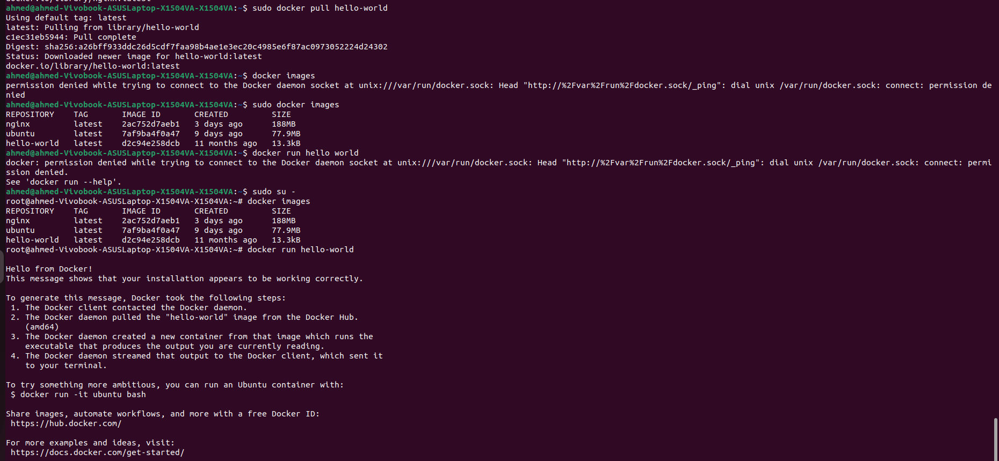
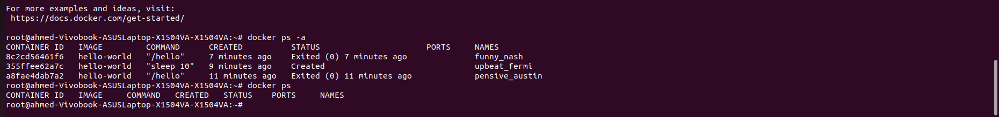
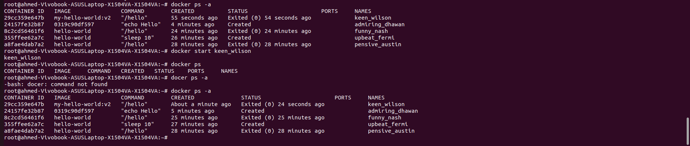
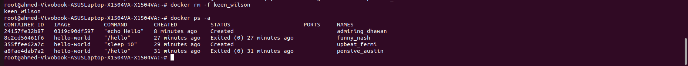
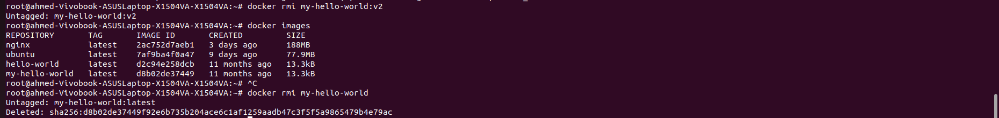
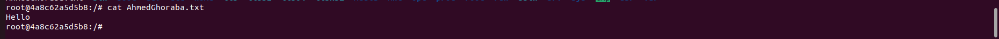
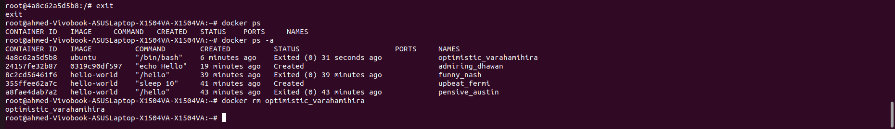
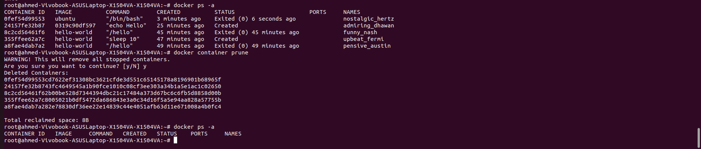
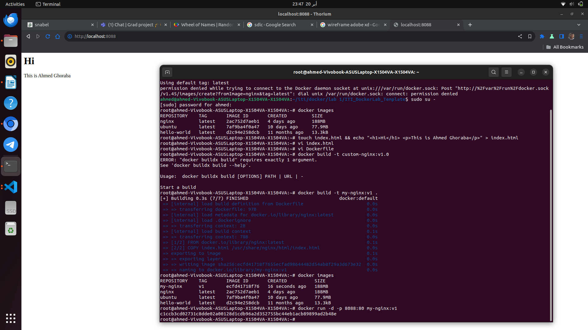

# ITI - Docker Lab 🐋

## Task 1: Working with Docker Hello-world Image

### Objective

Learn how to run a container using the hello-world image and manage containers and images.

### Steps

#### 1. Run a Container with hello-world Image

```bash
docker pull hello world
docker run hello-world
```

#### ScreenShot:



#### 2. Check Container Status and Explain

```bash
docker ps -a
```

#### Explanation:

container is stopped because there's no other command running and won't show in docker ps alone

##### ScreenShot



#### 3. Start the Stopped Container

```bash
docker start keen_wilson ('my container name')
```



#### 4. Remove the Container

```bash
docker rm -f keen_wilson ('my container name')
```



#### 5. Remove the Image

```bash
docker rmi my-hello-world:v2
# removes the tag
docker rmi my-hello-world
# removes the image
```

## 

## Task 2: Running Container with Ubuntu Image

### Objective

Run an Ubuntu container in interactive mode, create a file inside it, and manage containers.

### Steps

#### 1. Run Ubuntu Container in Interactive Mode

```bash
docker pull ubuntu
docker run -it ubuntu /bin/bash

```

#### 2. Create a File inside the Container

```bash
root@4a8c62a5d5b8:/# apt update
root@4a8c62a5d5b8:/# apt install vim
root@4a8c62a5d5b8:/# vim AhmedGhoraba.txt
```



#### 3. Stop and Remove the Container

```bash
root@4a8c62a5d5b8:/# exit
docker ps -a
docker rm optimistic_varahamihira
```



#### 4. Check File Status

```bash
docker run -it ubuntu /bin/bash
root@0fef54d99553:/# ls

```

#### No file exists

#### 5. What happened to hello-docker file?

#### It was deleted as all changes made to the container are deleted when the container is removed and not saved to the img.

#### 6. Remove All Stopped Containers

```bash
docker container prune
docker ps -a
```

#### 7. Bonus: Remove All Containers in One Command

```bash
Was done above ^_^
```

## 

## Task 3: Creating a Custom Nginx Docker Image

### Objective

Create a custom Docker image using Nginx and a local HTML file.

### Steps

#### 1. Create a Local HTML File

```bash
touch index.html && echo "<h1>Hi</h1> <p>This is Ahmed Ghoraba</p>" > index.html

```

#### 2. Write Dockerfile and Copy the HTML file to the Docker Image

```bash
 vi Dockerfile

```

```bash
FROM nginx
COPY index.html /usr/share/nginx/html/index.html

```

building the image

```bash
docker build -t my-nginx:v1 .

```

#### 3. Run Container with New Image

```bash
docker run -d -p 8088:80 my-nginx:v1

```

#### 4. Test the Container, open your browser and navigate to http://localhost:8088 to check if everything is okay

## 
